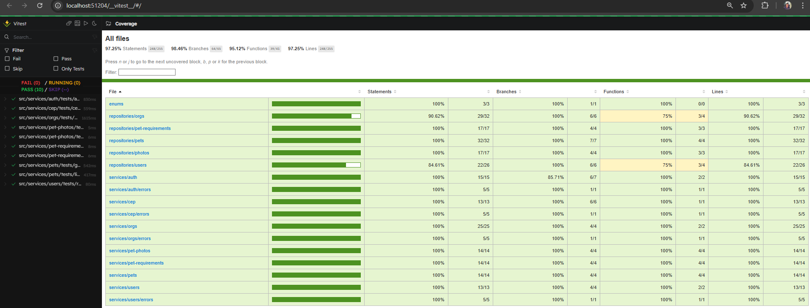
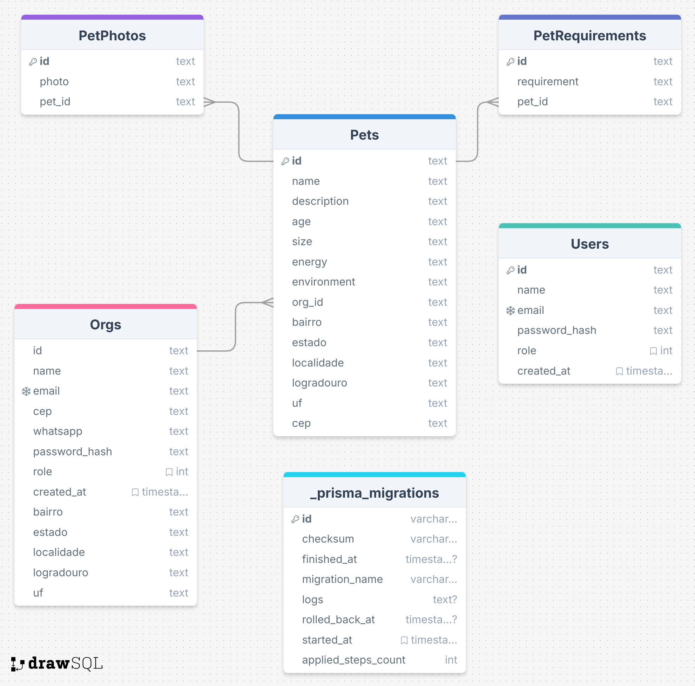

# Find a friend

A project created to practice Docker, Node.js, TypeScript, Prisma, PostgreSQL, Fastify and Vitest. JWT for authentication and authorization. Also CI using Github actions for running both unit tests and e2e tests. Basically an application for animal adoption, using some of the SOLID principles. This was actually a challenge that I had to create for a Node.js course I'm currenly taking.

## Prerequisites

Requirements for running the app locally
- [Docker](https://www.docker.com/)
- [Node](https://nodejs.org/)
- [Npm](https://www.npmjs.com/)


## How to use

```bash
# Clone this repository
$ git clone https://github.com/fcbento/node-prisma-docker-postgresql-ci.git

# Go into the repository
$ cd node-prisma-docker-postgresql-ci

# Install dependencies
$ npm install

# Start container
$ docker compose up --detach
$ docker container ls

# Create migrations
$ prisma migrate dev

# Run the app
$ npm run start:dev

# Unit tests
$ npm run test

# E2e tests
$ npm run test:e2e
```

## Key Features

### Application Rules

- [x] It must be possible to register a pet  
- [x] It must be possible to list all pets available for adoption in a city  
- [x] It must be possible to filter pets by their characteristics  
- [x] It must be possible to view details of a pet available for adoption  
- [x] It must be possible to register as an ORG  
- [x] It must be possible to log in as an ORG  

### Business Rules

- [x] To list the pets, it is mandatory to provide the city  
- [x] An ORG must have an address and a WhatsApp number  
- [x] A pet must be linked to an ORG  
- [ ] The user who wants to adopt will contact the ORG via WhatsApp  
- [x] All filters, except for the city, are optional  
- [x] For an ORG to access the application as an admin, it must be logged in  

### Tests Coverage

| Metric       | Coverage | Covered | Total |
|--------------|----------|---------|-------|
| Statements   | 97.25%   | 248     | 255   |
| Branches     | 98.46%   | 64      | 65    |
| Functions    | 95.12%   | 39      | 41    |
| Lines        | 97.25%   | 248     | 255   |



### DB Schema



### TODO

- [ ] Fix mixed language fields. Currently some fields of the PET and ORG tables are mixed using both Portuguese and English.
- [ ] Validate empty id in routes that the id is passed as an arugment and ideally return a friendly error message
- [ ] Validate if org_id is a valid id when registering a new pet
- [ ] Validate if pet_id is a valid id when registering either a new photo or a new requirement
- [ ] Check if it's possible to use a global zip postal code to populate fields ragarding the address of pet and org. Currently the zip code service (cep-api-service.ts) only works for zip codes in Brazil. I tried to use Zipcodestack, but the requisition was too slow.
- [ ] Add swagger/openapi
- [ ] Create CD and publish to some free hosting service
 
## Built With

This was created with the following tech stack. I intend to create a front end using Angular with Nx.

[](https://skillicons.dev)

#### To come
[](https://skillicons.dev)

## Top contributors

<a href="https://github.com/fcbento/node-prisma-docker-postgresql-ci/graphs/contributors">
  
</a>

## Contact

[](https://linkedin.com/in/felipe-bento)
[](https://discordapp.com/users/413141379074490369)
[](mailto:felipe.16costa@gmail.com)